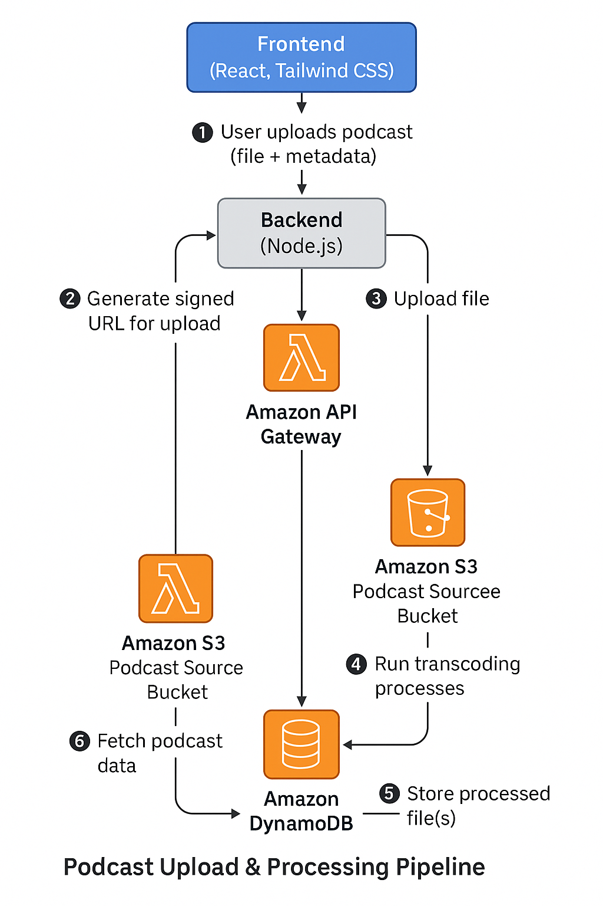

# 🎙️ Podcast Streaming Platform (Serverless)

This is a serverless podcast streaming platform built with:
- **Frontend**: React + Tailwind CSS
- **Backend**: Node.js + Express
- **Authentication**: AWS Cognito
- **Storage**: AWS S3 (Source & Processed Buckets)
- **Processing**: AWS Lambda + FFmpeg
- **Database**: DynamoDB

---

## 🚀 Features

- ✅ User registration, confirmation & login via AWS Cognito
- ✅ Upload podcast videos directly to S3 (with metadata)
- ✅ Automatic Lambda processing: generates multiple resolutions & thumbnails
- ✅ Podcasts saved to DynamoDB with metadata
- ✅ Discover page listing all podcasts
- ✅ Public streaming with resolution switching (480p, 720p)

---

## ⚙️ Tech Stack

| Part       | Tech                               |
|------------|------------------------------------|
| Frontend   | React, Tailwind CSS                |
| Backend    | Node.js, Express                   |
| Auth       | AWS Cognito                        |
| Storage    | AWS S3                             |
| Processing | AWS Lambda, FFmpeg                 |
| Database   | AWS DynamoDB                       |

---

## 📸 Architecture Diagram

---

## 🔑 How it works

1. User registers/login via Cognito.
2. Uploads podcast video + metadata.
3. Gets a signed S3 URL and uploads directly.
4. S3 triggers Lambda.
5. Lambda:
   - Downloads the file.
   - Generates 720p, 480p versions & thumbnail using FFmpeg.
   - Uploads processed files to S3.
   - Stores podcast record in DynamoDB.
6. Frontend Discover page lists all podcasts & plays them.

